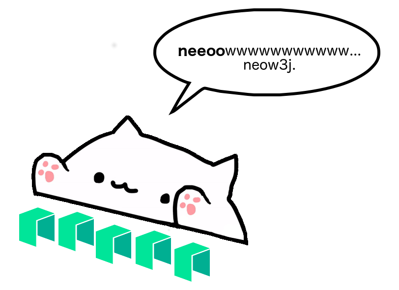

# neow3j: A Java Library to interact with NEO nodes

Neow3j is a Java library that aims to provide easy and reliable integration with NEO nodes.
By using neow3j, you will happily play with NEO and end up neow'ing around like [Bongo Cat](https://knowyourmeme.com/memes/bongo-cat).

You can now focus on building Java/Android applications that use the functions provided by the NEO blockchain, without being concerned about writing specific code to integrate with NEO nodes.

Visit http://docs.neow3j.io for more information on neow3j and the technical documentation.

Neow3j is an open-source project developed by the community and maintained by [AxLabs](https://axlabs.com).

## Donate

Help the development of neow3j by donating to the following addresses:

| Crypto   | Address                                      |
|----------|----------------------------------------------|
| NEO      | `AHb3PPUY6a36Gd6JXCkn8j8LKtbEUr3UfZ`         |
| ETH      | `0xe85EbabD96943655e2DcaC44d3F21DC75F403B2f` |
| BTC      | `3L4br7KQ8DCJEZ77nBjJfrukWEdVRXoKiy`         |

## Thanks and Credits

* [NEO Foundation](https://neo.org/team) & [NEO Global Development (NGD)](https://neo.org/team)
* This project was strongly based on [web3j](https://web3j.io),
a library originally developed by [Conor Svensson](http://conorsvensson.com), latest on [this commit](https://github.com/web3j/web3j/commit/2a259ece9736c0338fbb66b1be4c04aba0855254).
We are really thankful for it. :-)
