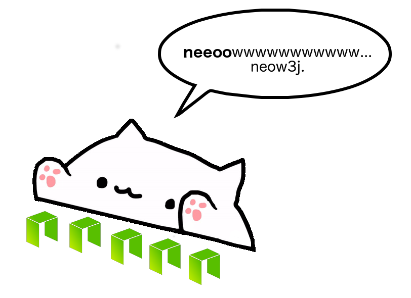

# neow3j: A Java Library to interact with NEO nodes

<p align="center">

</p>

**Neow3j** is a Java library that aims to provide an easy and reliable integration to NEO nodes/clients.

By using **neow3j**, you will happily play with NEO and end up "neow'ing" around like [Bongo Cat](https://knowyourmeme.com/memes/bongo-cat). You can now focus on building Java/Android applications that use the [functions](#NEO-API-Support) provided by the NEO blockchain -- without being concerned on writing specific code to integrate with NEO nodes/clients.

**Neow3j** is an open-source project developed by the community and maintained by [AxLabs](https://axlabs.com).

## Features

* Support to NEO node/client [API version 2.9.0](http://docs.neo.org/en-us/node/cli/2.9.0/api.html) (~70% currently implemented, mostly "get" methods)
* Observable pattern to get info about past **and** upcoming NEO blocks
* Passphrase-protected Private Key implementation (NEP-2)
* Wallet SDK implementation (NEP-6)
* Mneumonic utils implementation (BIP-39), compatible to NEO
* Multisig addresses
* Signing and sending raw transactions
* Sync and Async interface
* Retry on node errors

## Upcoming Features

* Android support (Java 1.8)
* 100% implementation of [API version 2.9.0](http://docs.neo.org/en-us/node/cli/2.9.0/api.html)
* Documentation on using neow3j with Android apps
* Observable pattern to get specific transactions
* Improve the response model: introduce purpose-specific objects rather than the current raw Java types
* Select best seed NEO node based on some metrics (e.g., latency)

## Getting Started

Add the neow3j dependencies to your Java project -- either using Gradle or Maven:

### Gradle

Java 8:

```
compile 'com.axlabs:neow3j-core:1.0.1'
```

### Maven

Java 8:

```
<dependency>
    <groupId>com.axlabs</groupId>
    <artifactId>neow3j-core</artifactId>
    <version>1.0.1</version>
</dependency>
```

## Examples

* Initialize the Neow3j lib providing the JSON-RPC's endpoint of a NEO node/client:

```
Neow3j neow3j = Neow3j.build(new HttpService("http://seed1.ngd.network:10332"));
```

* Get all blocks starting from, e.g. `2889367`, and subscribe to also get newly generated NEO blocks:

```
neow3j.catchUpToLatestAndSubscribeToNewBlocksObservable(new BlockParameterIndex(2889367), true)
        .subscribe((blockReqResult) -> {
            System.out.println("#######################################");
            System.out.println("blockIndex: " + blockReqResult.getBlock().getIndex());
            System.out.println("hashId: " + blockReqResult.getBlock().getHash());
            System.out.println("confirmations: " + blockReqResult.getBlock().getConfirmations());
            System.out.println("transactions: " + blockReqResult.getBlock().getTransactions());
        });

```

Or, you can just subscribe to the newly generated NEO blocks:

```
w.catchUpToLatestAndSubscribeToNewBlocksObservable(BlockParameterName.LATEST, true)
        .subscribe((blockReqResult) -> {
            System.out.println("#######################################");
            System.out.println("blockIndex: " + blockReqResult.getBlock().getIndex());
            System.out.println("hashId: " + blockReqResult.getBlock().getHash());
            System.out.println("confirmations: " + blockReqResult.getBlock().getConfirmations());
            System.out.println("transactions: " + blockReqResult.getBlock().getTransactions());
        });
```

* Get the latest block index received by the NEO node:

```
NeoBlockCount blockCountReq = w.getBlockCount().send();
System.out.println(blockCountReq.getBlockIndex());
```

* Validate whether an address is a valid NEO address:

```
NeoValidateAddress validateReq = w.validateAddress("ARvMqz3hEFE4qBkHAaPNxALquNQtBbH12f").send();
System.out.println("isValid=" + validateReq.getValidation().isValid());
```

* Get info about NEO consensus nodes:

```
NeoGetValidators getValidatorsReq = w.getValidators().send();
System.out.println(getValidatorsReq.getValidators());
```

## Donate

Help the development of neow3j by donating to the following addresses:

| Crypto   | Address                                      |
|----------|----------------------------------------------|
| NEO      | `ARvMqz3hEFE4qBkHAaPNxALquNQtBbH12f`         |
| ETH      | `0xe85EbabD96943655e2DcaC44d3F21DC75F403B2f` |
| BTC      | `3L4br7KQ8DCJEZ77nBjJfrukWEdVRXoKiy`         |

## NEO API Support

### Version 2.9.0

The following NEO JSON-RPC methods are implemented in neow3j:

- [ ] `dumpprivkey <address>`: Exports the private key of the specified address. **Needs to open the wallet**.
- [x] `getaccountstate <address>`: Checks account asset information according to account address.
- [ ] `getassetstate <asset_id>`: Queries asset information according to the specified asset number.
- [ ] `getbalance <asset_id>`: Returns the balance of the corresponding asset in the wallet according to the specified asset number. **Need to open the wallet**.
- [x] `getbestblockhash`: Gets the hash of the tallest block in the main chain.
- [x] `getblock <hash> [verbose=0]`: Returns the corresponding block information according to the specified hash value.
- [x] `getblock	<index> [verbose=0]`: Returns the corresponding block information according to the specified index.
- [x] `getblockcount`: Gets the number of blocks in the main chain.
- [x] `getblockhash <index>`: Returns the hash value of the corresponding block based on the specified index.
- [x] `getblockheader <hash> [verbose=0]`: Returns the corresponding block header information according to the specified script hash.
- [x] `getblocksysfee <index>`: Returns the system fees before the block according to the specified index.
- [x] `getconnectioncount`: Gets the current number of connections for the node.
- [ ] `getcontractstate <script_hash>`: Returns information about the contract based on the specified script hash.	
- [x] `getnewaddress`: Creates a new address. **Needs to open the wallet**.
- [x] `getrawmempool`: Gets a list of unconfirmed transactions in memory.
- [ ] `getrawtransaction <txid> [verbose=0]`: Returns the corresponding transaction information based on the specified hash value.
- [ ] `getstorage <script_hash> <key>`: Returns the stored value based on the contract script hash and key.
- [x] `gettxout <txid> <n>`: Returns the corresponding transaction output (change) information based on the specified hash and index.
- [x] `getpeers`: Gets a list of nodes that are currently connected/disconnected by this node.
- [x] `getversion`: Gets version information of this node.
- [x] `getvalidators`: Gets NEO consensus nodes information.
- [x] `getwalletheight`: Gets the current wallet index height. **Needs to open the wallet**.
- [ ] `invoke <script_hash> <params>`: Invokes a smart contract at specified script hash with the given parameters.
- [ ] `invokefunction <script_hash> <operation> <params>`: Invokes a smart contract at specified script hash, passing in an operation and its params.
- [ ] `invokescript <script>`: Runs a script through the virtual machine and returns the results.
- [x] `listaddress`: Lists all the addresses in the current wallet.	**Needs to open the wallet**.
- [x] `sendrawtransaction <hex>`: Broadcast a transaction over the network. See the network protocol documentation.
- [ ] `sendtoaddress <asset_id> <address> <value> [fee=0]`: Transfer to specified address. **Needs to open the wallet**.
- [ ] `sendmany <outputs_array> [fee=0] [change_address]`: Bulk transfer order. **Needs to open the wallet**.
- [ ] `submitblock <hex>`: Submit new blocks. **Needs to be a consensus node**.
- [x] `validateaddress <address>`: Verify that the address is a correct NEO address.

## Why "neow3j"?

This project is based on [web3j](https://web3j.io), but focusing on NEO. That's why the suffix "w3j" was added to the "neo" name, forming "neow3j".

Well... then, it was simply natural to imagine [Bongo Cat](https://knowyourmeme.com/memes/bongo-cat) playing on NEO nodes and "neow'ing" instead of "meow'ing", don't you think? :-)

## Thanks and Credits

* This project was strongly based on [web3j](https://web3j.io),
a library originally developed by [Conor Svensson](http://conorsvensson.com), latest on [this commit](https://github.com/web3j/web3j/commit/2a259ece9736c0338fbb66b1be4c04aba0855254).
We are really thankful for it. :-)
* [NEO Global Development (NGD)](https://neo.org/team)

